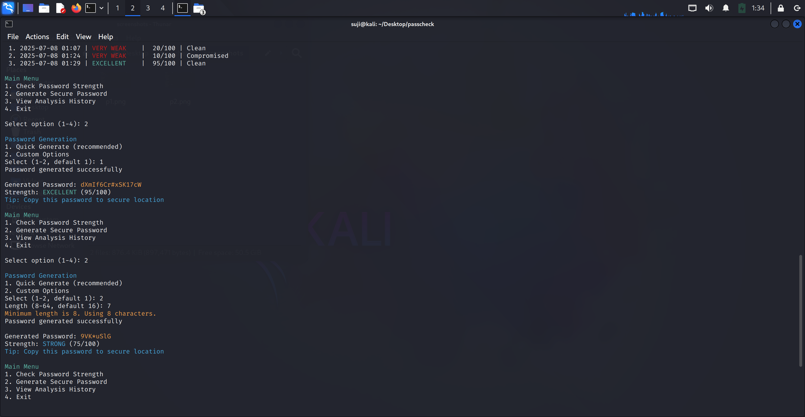

# PassCheck - Password Security Tool

A professional command-line password security assessment and generation tool that helps you analyze password strength and generate secure passwords.

## Features

- **Password Strength Analysis**: Comprehensive scoring system (0-100) based on length, character diversity, and complexity
- **Breach Detection**: Checks passwords against known data breaches using the HaveIBeenPwned API
- **Secure Password Generation**: Creates cryptographically secure passwords with customizable length
- **Analysis History**: Tracks your password analysis sessions locally
- **Professional Interface**: Clean, workplace-appropriate design with color-coded results

## Security Features

- Passwords are never stored or logged
- Uses SHA-1 hashing for breach detection (k-anonymity model)
- Cryptographically secure random password generation
- Local history storage with no external data transmission

## Installation

### Prerequisites

- Python 3.6 or higher
- pip package manager

### Install Dependencies

```bash
pip install -r requirements.txt
```

### Quick Install

```bash
git clone https://github.com/yourusername/passcheck.git
cd passcheck
pip install -r requirements.txt
python3 passcheck.py
```

## Usage

### Interactive Mode

Run the tool interactively:

```bash
python3 passcheck.py
```

### Command Line Mode

Generate a password directly:

```bash
# Generate 16-character password
python3 passcheck.py --generate 16

# Generate 20-character password
python3 passcheck.py -g 20
```

### Options
- `--generate LENGTH` or `-g LENGTH`: Generate a secure password of specified length
- `--no-ambiguous`: Exclude ambiguous characters (0OlI1) when generating passwords
- `--version`: Show version information
- `--help`: Show help message

## Password Scoring System

PassCheck uses a comprehensive scoring system:
- **Length (0-35 points)**: Longer passwords get higher scores
- **Character Types (0-45 points)**: Uppercase, lowercase, numbers, special characters
- **Diversity (0-15 points)**: Unique character ratio
- **Pattern Penalties**: Deductions for common patterns, dates, dictionary words

### Rating Scale
- **90-100**: Excellent 
- **70-89**: Strong 
- **50-69**: Moderate 
- **30-49**: Weak 
- **0-29**: Very Weak 

## File Structure
```
passcheck/
├── passcheck.py          # Main application
├── requirements.txt      # Python dependencies
├── README.md            # you are reading thus file now
├── LICENSE              # MIT License
└── .gitignore           # Git ignore file
```

## Security Considerations

- **No Password Storage**: PassCheck never stores your actual passwords
- **Breach Detection**: Uses k-anonymity model - only first 5 characters of password hash are sent
- **Local Processing**: All analysis happens locally on your machine
- **History Privacy**: Analysis history contains only scores and ratings, not passwords

## Dependencies

- `requests`: For breach detection API calls
- `colorama`: For cross-platform colored terminal output
- `pyfiglet`: For ASCII art banner

## Contributing
1. Fork the repository
2. Create a feature branch (`git checkout -b feature/amazing-feature`)
3. Commit your changes (`git commit -m 'Add amazing feature'`)
4. Push to the branch (`git push origin feature/amazing-feature`)
5. Open a Pull Request

## License
This project is licensed under the MIT License - see the [LICENSE](LICENSE) file for details.

## Acknowledgments

- [HaveIBeenPwned](https://haveibeenpwned.com/) for the breach detection API
- [OWASP](https://owasp.org/) for password security guidelines
- Contributors and testers

## Changelog

### Version 1.0
- Initial release
- Basic password strength analysis
- Simple password generation

## Support
If you encounter any issues or have questions:

1. Check the [Issues](https://github.com/yourusername/passcheck/issues) page
2. Create a new issue with detailed information
3. Include your Python version and operating system

## Disclaimer
This tool is for educational and security assessment purposes. Always use unique, strong passwords for your accounts and enable two-factor authentication when available.


## Demo Output




